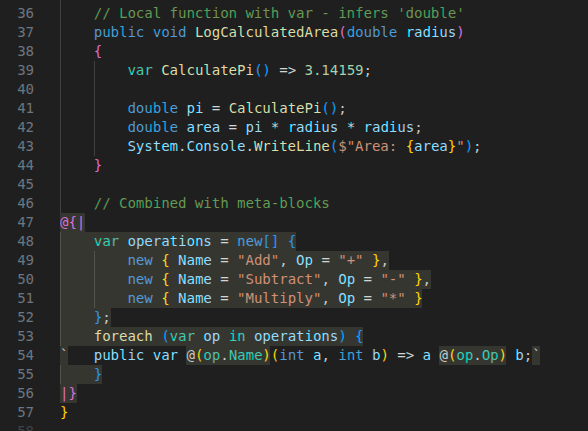

# Blake Language

Blake is a C# superset that adds metaprogramming capabilities. Write compile-time code that generates runtime code, right in your source files.

## Features

- **`@{| |}`** - Meta-blocks: C# code executed at compile time
- **`` ` ``** - Quasi-quotes: Output templates inside meta-blocks
- **`@(expr)`** - Splices: Interpolate compile-time values into quasi-quotes
- **`var`** as a valid function return value (compiler infers return type)
- **`@@`** / **` `` `** - Escape sequences for literal `@` and backtick
- Full C# syntax support outside meta-blocks (passthrough)
- VSCode syntax highlighting and language server support

## Examples

Example 1

```csharp
public class Person
{
    public var GetName() { return "Bob"; }
}
```

Output C#:

```csharp
public class Person
{
    public string GetName() { return "Bob"; }
}
```

---

Example 2
```csharp
@{|
// reflects upon compilation AST to find things with interface `MyApp.ICommand`
var commands = Blake.FindTypesImplementing("MyApp.ICommand");
foreach (var cmd in commands)
{
`   public @(cmd.ToDisplayString()) @(cmd.Name) { get; set; }`
}
|}
```

Generated output:
```csharp
    public MyApp.CreateUserCommand CreateUserCommand { get; set; }
    public MyApp.DeleteUserCommand DeleteUserCommand { get; set; }
    public MyApp.UpdateUserCommand UpdateUserCommand { get; set; }
```

---

Example 3

```csharp
@{|
var count = 5;
for (int i = 0; i < count; i++)
{
    // Backtick strings output to the generated file
    // Newline is implicit after the closing backtick
`   public int Field@(i) { get; set; }`
}
|}
```

Output C#:

```csharp
   public int Field0 { get; set; }
   public int Field1 { get; set; }
   public int Field2 { get; set; }
   public int Field3 { get; set; }
```

---

Example 4

```csharp
@{|
    var name = "MyProperty";
    var type = "string";
`   public @(type) @(name) { get; set; }`
|}
```

Output C#:

```csharp
    public string MyProperty { get; set; }
```

---

Example 5

```csharp
@{|
    var items = new[] { "A", "B", "C" };
    var i = 1;
`var thing = new
{`
    foreach (var item in items)
    {
`   Prop@(i++) = "@(item)",`
    }
`};`
|}
```

Output C#:

```csharp
var thing = new
{
    Prop1 = "A",
    Prop2 = "B",
    Prop3 = "C",
};
```

## Try the Sample

```bash
dotnet publish samples/Sample.App/Sample.App.csproj -o samples/Sample.App/bin/publish --force
dotnet samples/Sample.App/bin/publish/Sample.App.dll
```

## Quick Start

### 1. Install the NuGet Package

```bash
dotnet add package Blake.SourceGenerator
```

### 2. Create a `.blake` File

```csharp
// User.blake
namespace MyApp.Models;

public class User
{
    public int Id { get; set; }

@{|
    // This C# code runs at compile time
    var fields = new[]
    {
        ("FirstName", "string"),
        ("LastName", "string"),
        ("Email", "string"),
        ("Age", "int?"),
    };

    foreach (var (name, type) in fields)
    {
        // Backtick strings are output - they emit to the generated file
        // @(expr) splices in the compile-time value
`   public @(type) @(name) { get; set; }`
    }
|}
}
```

### 3. Build Your Project

The source generator transforms `User.blake` into the following `User.blake.g.cs` C# output:

```csharp
// <auto-generated>
namespace MyApp.Models;

public class User
{
    public int Id { get; set; }

    public string FirstName { get; set; }
    public string LastName { get; set; }
    public string Email { get; set; }
    public int? Age { get; set; }
}
```

## Blake Metaprogramming API

### Blake.FindTypesImplementing(string fullTypeName)

Find all types in the current compilation and referenced assemblies that implement a specific interface or inherit from a base class.

**Parameters:**
- `fullTypeName`: Fully qualified type name (e.g., "MyNamespace.ICommand")

**Returns:** `IEnumerable<INamedTypeSymbol>` - Roslyn symbol objects for each matching type

**Example:**
```csharp
@{|
var commands = Blake.FindTypesImplementing("MyApp.ICommand");
foreach (var cmd in commands)
{
`   public @(cmd.ToDisplayString()) @(cmd.Name) { get; set; }`
}
|}
```

Generated output:
```csharp
    public MyApp.CreateUserCommand CreateUserCommand { get; set; }
    public MyApp.DeleteUserCommand DeleteUserCommand { get; set; }
    public MyApp.UpdateUserCommand UpdateUserCommand { get; set; }
```

## How It Works

```
┌──────────────┐     ┌──────────────┐     ┌──────────────┐
│  .blake file │────▶│ Blake Parser │────▶│  Blake AST   │
└──────────────┘     └──────────────┘     └──────────────┘
                                                 │
                                                 ▼
                                        ┌──────────────────┐
                                        │   Interpreter    │
                                        │     (Roslyn)     │
                                        └──────────────────┘
                                                 │
┌──────────────┐     ┌──────────────┐            │
│   .g.cs      │◀────│  C# Emitter  │◀───────────┘
└──────────────┘     └──────────────┘
```

1. **Parser** separates C# passthrough from meta-blocks
2. **Within meta-blocks**, backtick strings become output templates
3. **Interpreter** runs meta-code via Roslyn Scripting
4. **Quasi-quotes** are expanded with splice values
5. **Emitter** produces the final `.g.cs` file

## VSCode Extension

Install the Blake Language extension for:
- Syntax highlighting for `.blake` files
- Bracket matching for `@{| |}`
- Quasi-quote highlighting inside meta-blocks

The yellow background sections represent compile-time-evaluated code that will be run and then removed from the output, and everything else is output to the generated file.



## Running Tests

```
dotnet test
```

## Project Structure

```
src/
  |___Blake.SourceGenerator/    : the Roslyn source generator that compiles .blake files
  |   |
  |   |___BlakeGenerator.cs     : the definition for the source generator
  |   |
  |   |___BlakeParser.cs        : parser/lexer to parse .blake files
  |   |
  |   |___BlakeAST.cs           : syntax tree to store parsed representation
  |   |
  |   |___BlakeInterpreter.cs   : interprets the AST and outputs C# code,
  |                               also does basic transforms like var->inferred type
  |
  |___Blake.VsCode/             : vscode extension for syntax highlighting
  |
  |___Blake.LanguageServer/     : vscode language server for intellisense

samples/Sample.App/             : contains a sample app you can build/run

tests/                          : test suite for the source generator
```

## License

MIT License - see [LICENSE](LICENSE).
